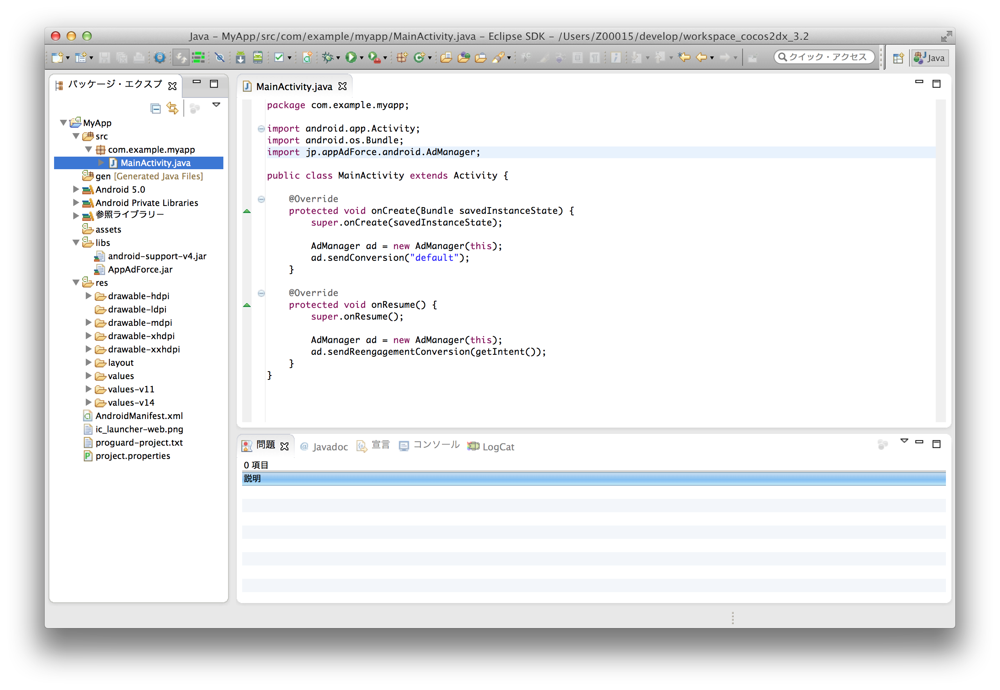

## The detail of sendConversion method

By implementing install tracking , it is able to start the effectiveness measurements of advertisement. When using cookie tracking, the external browser is activated. In this case, you can specify the URL string as the argument of `sendConversion` as the transition destination of the external browser.

Please implement in a order following.

> NOTE:
Please implement `sendConversion` within the onCreate of the Activity called when the application is started unless there is a special reason. If it is mounted in other places, the installation number may not be accurately measured.

```java
import jp.appAdForce.android.AdManager;

@Override
public void onCreate(Bundle savedInstanceState) {
	AdManager ad = new AdManager(this);
	ad.sendConversion("default");
}
```

Input the string "default" to the argument of sendConversion as above. By default, the page prepared by F.O.X is displayed, but it is possible to set the URL of the transition destination arbitrarily on the F.O.X management console.



If you want to transition to a specific URL or if you want to dynamically generate a URL in your application, please set the character string of the URL.

```java
ad.sendConversion("http://yourhost.com/yourpage.html");
```

You can pass the User ID as the second argument of the `sendConversion`. For example, it can be used when you want to generate UUID at the time of launching the application and manage to relate it and first launch connection.

```java
ad.sendConversion("default", "your unique id");
```
> sendConversionWithStartPage cannot pass Login ID as arguments because of implementing this as function launch directory.

### Receive installation measurement completion callback

By using `TrackingStateListener` like the following implementation, you can receive callback of installation measurement completion.

```java
import jp.appAdForce.android.AdManager;
import jp.appAdForce.android.TrackingStateListener;

	@Override
	public void onCreate(Bundle savedInstanceState) {
			AdManager ad = new AdManager(this);
			ad.setTrackingStateListener(new TrackingStateListener() {
				@Override
				public void onComplete() {
					Toast.makeText(ThisActivity.this, "Complete the tracking", Toast.LENGTH_LONG).show();
				}
			}).sendConversion("default");
	}

	@Override
	protected void onResume() {
			super.onResume();
			AdManager ad = new AdManager(this);
			ad.sendDeeplinkConversion(getIntent());
	}
```

> * In the case of cookie measurement, the browser is started and measurement is performed.
After the measurement is completed, the `onComplete` method is called immediately after the application returns to the foreground.
* Be sure to implement the `sendDeeplinkConversion` method in `onResume` of Activity that is called upon when relaunching the application.

---
[TOP](/lang/en/README.md)
