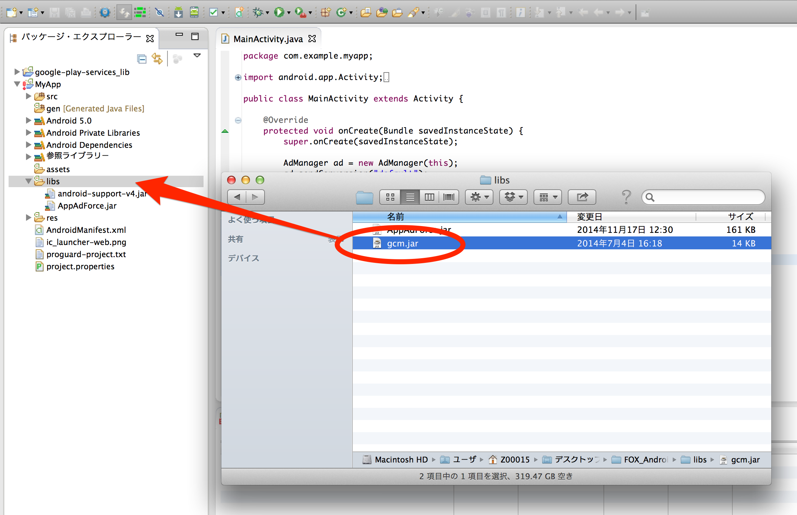
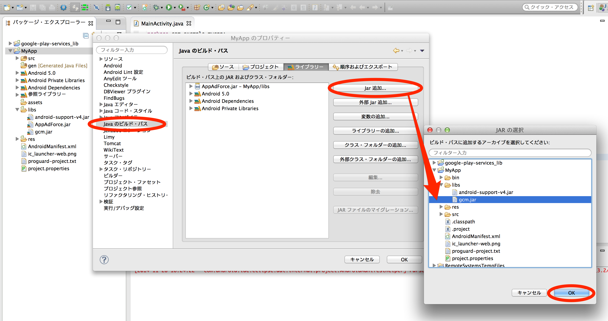
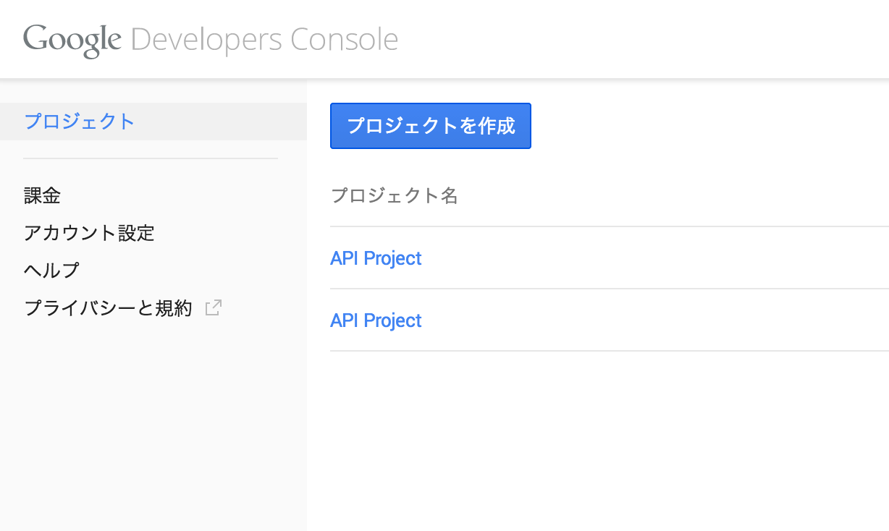
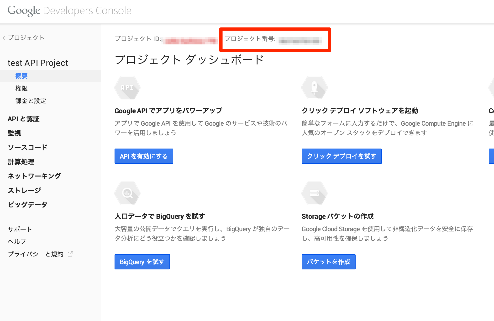
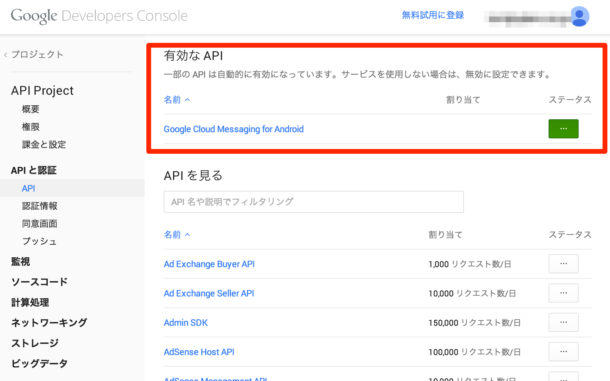
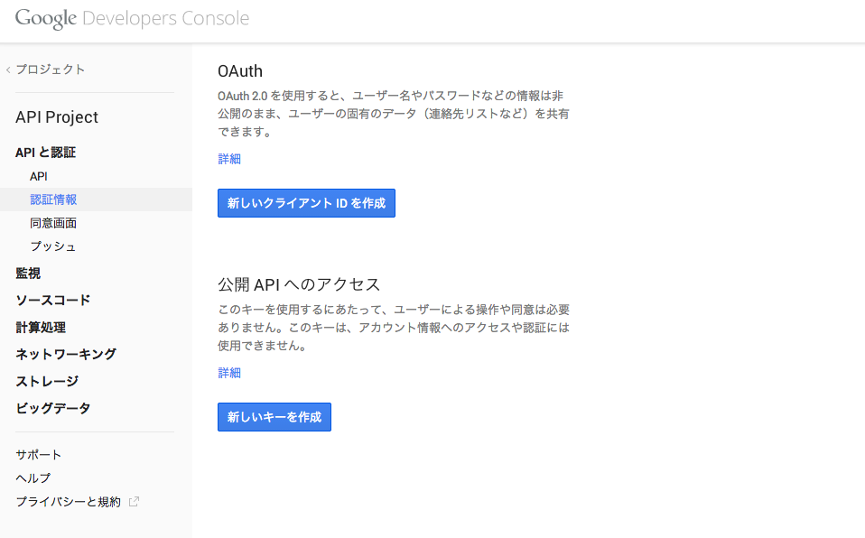
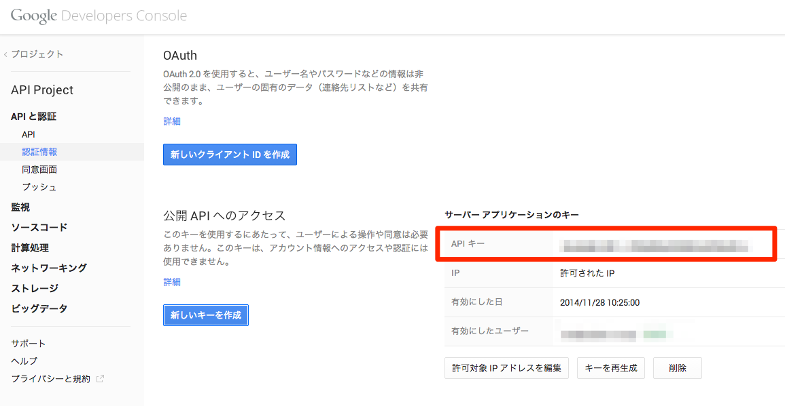

## 푸시 알림 구현
F.O.X푸시 알림 기능은 Google이 제공하는 GCM (Google Cloud Messaging for Android)를 이용하여 사용자의 단말기에 푸시 알림을 실시하는 기능입니다.
푸시 알림을 위해 다음의 구현을해야합니다.

## gcm.jar의 추가

- Android 프로젝트 「libs」폴더 아래에 gcm.jar를 복사합니다.
- Android 프로젝트를 선택하고 마우스 오른쪽 버튼 클릭 → 「프로퍼티」를 선택합니다.
- 왼쪽의 메뉴에서 「Java 빌드・경로」를 선택합니다.
- 오른쪽의 메인 화면에있는 「라이브러리」탭을 선택합니다.
- 메인 화면의 오른쪽에있는 「Jar 추가」를 선택합니다.
- Android 프로젝트 「libs」폴더에 배치했다 "gcm.jar"를 선택합니다.
- 참조 라이브러리에 「gcm.jar」가 추가되어 있는지 확인합니다.





## AndroidManifest.xml의 설정

### 권한 설정

아래와 같이 푸시 알림을받을 데 필요한 권한 설정을 \<manifest\> 태그에 추가하십시오.

```xml
<uses-permission android:name="android.permission.WAKE_LOCK" />
<uses-permission android:name="앱의 패키지명.permission.C2D_MESSAGE" />
<permission android:name="앱의 패키지명名.permission.C2D_MESSAGE" android:protectionLevel="signature" />
<uses-permission android:name="com.google.android.c2dm.permission.RECEIVE" />
```

### 푸시 알림용 리시버의 설정

아래와 같이 푸시 알림을 받기 위하여 필요한 리시버의 설정을 \<application\> 태그에 추가하십시오.

```xml
<receiver android:name="jp.appAdForce.android.NotifyReceiver"
	android:permission="com.google.android.c2dm.permission.SEND">
	<intent-filter>
		<action android:name="com.google.android.c2dm.intent.RECEIVE" />
		<action android:name="com.google.android.c2dm.intent.REGISTRATION" />
		<category android:name="アプリのパッケージ名" />
	</intent-filter>
</receiver>
```

### 두개의 리시버를 공존시키는 경우

com.google.android.c2dm.intent.RECEIVE과 com.google.android.c2dm.intent.REGISTRATION 대한 리시버 클래스는 하나 밖에 선택할 수 없습니다. 응용 프로그램이 두개의 리시버 클래스를 필요로하는 경우에는 다음 설정을 추기하십시오.

```xml
<meta-data android:name="APPADFORCE_NOTIFY_RECEIVER" android:value="공존 시키고 싶은 F.O.X 이외의 리시버 클래스"/>
```

내부적으로는 jp.appAdForce.android.NotifyReceiver 클래스에서 공존시키고 싶은 리시버 클래스의 onResume() 또는 onMessage(), onRegistered()를 호출합니다.

## Main Activity 설정

앱이 시작될 때 호출되는 Activity의 onCreate()에 다음의 처리를 구현합니다.

```java
import jp.appAdForce.android.AdManager;
import jp.appAdForce.android.NotifyManager;

@Override
public void onCreate(Bundle savedInstanceState) {

	//...

	AdManager ad = new AdManager(this);
	ad.sendConversion("default");

	NotifyManager notifyManager = new NotifyManager(this, ad);
	String regId = notifyManager.getRegistrationId();
	if ("".equals(regId)||regId == null) {
		GCMRegistrar.register(this, ××××);
	}
}
```

GCMegistrar.register의 두 번째 매개변수에는 Project 번호를 입력하십시오.

### Project 번호 및 API KEY 취득에 대해서

* https://console.developers.google.com/project 에 액세스합니다.
* API 프로젝트를 작성하지 않은 경우, "프로젝트 생성"을 누르면 프로젝트를 만듭니다.



* 프로젝트를 선택합니다.
* 화면 상단에 프로젝트 번호가 표시되어 있으니 값을 참조하십시오.





* 화면 왼쪽의 메뉴에서 「API와 인증」 > 「API」를 선택합니다.
* Google Cloud Messaging for Androidのステータスをオンにします。



* 화면 왼쪽의 메뉴에서 「API와 인증」 > 「인증정보」를 선택합니다.



* API 키를 생성하지 않는 경우, 공개 API에 대한 액세스 「새로운 키를 작성」를 누르면 「서버 키」를 선택하여 API 키를 작성합니다.

* 작성한 키의 API 키를 가져옵니다.





## 전환 대상 지정(이동할 곳 지정)

Push 알림을 탭했을때 앱내의 임의의 지점을 열 수 있습니다. 전환 대상 URL 스키마는 F.O.X의 관리 화면에서 설정할 수 있습니다.

AndroidManifest.xml 상에서, Push 알림을 탭할때 기동시키고 싶은 Activity 태그 내에 URL 스키마의 설정을 해주십시오.

예를 들어, "foo://bar"이라는 URL 스키마를 이용하여 ExampleActiviy를 기동시키고 싶은 경우의 설정을 기술합니다.

```xml
<activity android:name=".ExampleActivity" >
	<intent-filter>
		<category android:name="android.intent.category.DEFAULT" />
		<category android:name="android.intent.category.BROWSABLE" />
		<action android:name="android.intent.action.VIEW" />
		<data android:host="bar" android:scheme="foo" />
	</intent-filter>
</activity>
```


---
[TOP으로](/lang/ko/README.md)
